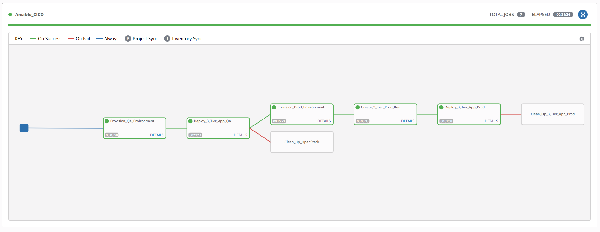

**Background**

MitziCom, a telecommunications company, provides hosting and cloud services to a variety of clients, from medium-sized companies to enterprise giants.

MitziCom has requested a proof-of-concept using Red Hat Ansible Tower. The purpose of the POC is to determine the feasibility of using Ansible Tower as a CI/CD tool for automating continuous deployment of an internal three-tier application on QA and production environments.


**Environment**

- OpenStack Platform Workstation: workstation-7655.rhpds.opentlc.com
- Production Bastion/Jump-Server: `Created During Workflow Execution`
- Ansible Tower (Cluster): [Tower 1](https://tower1.ffe9.example.opentlc.com), [Tower 2](https://tower2.ffe9.example.opentlc.com), [Tower 3](https://tower3.ffe9.example.opentlc.com)


**Ansible Tower Setup/Workflow**

1. Add [public key](http://www.opentlc.com/download/ansible_bootcamp/openstack_keys/openstack.pub) to *authorized_keys* of the `cloud-user` on the OpenStack Platform Workstation

2. Create `Advanced_Ansible_Lab` inventory in Ansible Tower
    - Create `osp_workstation` host

3. Create `cloud-user` credentials (Machine Login) in Ansible Tower using [private key](http://www.opentlc.com/download/ansible_bootcamp/openstack_keys/openstack.pem) 

4. Create new project, i.e. `Advanced_Ansible_Lab_Assignment` using Git SCM Type, pointing to this [repository](https://github.com/eanylin/ansible-lab)
    - Set SCM Update Option to `Clean` and `Update on Launch`

5. Create new Job Template, i.e. *Provision_QA_Environment* with the following settings:
    - Inventory: `Advanced_Ansible_Lab`
    - Project: `Advanced_Ansible_Lab_Assignment`
    - Playbook: `assignment_lab/provision_osp.yml`
    - Credential: `cloud-user (Machine)`
    - Verbosity: 2

6. Create new Job Template, i.e. *Deploy_3_Tier_App_QA* with the following settings:
    - Inventory: `Advanced_Ansible_Lab`
    - Project: `Advanced_Ansible_Lab_Assignment`
    - Playbook: `assignment_lab/configure_3TA_OSP.yml`
    - Credential: `cloud-user (Machine)`
    - Verbosity: 2

7. Go to Ansible Tower `INVENTORIES / Advanced_Ansible_Lab / GROUPS` and create new groups for
    - frontends
    - apps
    - appdbs

   Define the following variables for each of the newly created group
   ```
   ansible_user: cloud-user
   ansible_connection: ssh
   ansible_ssh_common_args: '-o ProxyCommand="ssh -W %h:%p -q cloud-user@workstation-${GUID}.rhpds.opentlc.com"'
   ```  

8. Create new Job Template, i.e. *Clean_Up_OpenStack* with the following settings:
    - Inventory: `Advanced_Ansible_Lab`
    - Project: `Advanced_Ansible_Lab_Assignment`
    - Playbook: `assignment_lab/cleanup_OSP.yml`
    - Credential: `cloud-user (Machine)`
    - Verbosity: 2

9. Create new credential type, i.e. `OpenTLC`
    - Go to `SETTINGS / CREDENTIAL TYPES`
    - The Input Configuration will be
      ```
      fields:
        - type: string
          id: username
          label: OpenTLC Username
        - secret: true
          type: string
          id: password
          label: OpenTLC Password
      required:
        - username
        - password
      ```
    - The Injector Configuration will be
      ```
      extra_vars:
        opentlc_password: '{{ password }}'
        opentlc_username: '{{ username }}'
      ```

10. Create new credential with credential type `OpenTLC`, with your OpenTLC username and password

11. Create new Job Template, i.e. *Provision_Prod_Environment* with the following settings:
    - Inventory: `Advanced_Ansible_Lab`
    - Project: `Advanced_Ansible_Lab_Assignment`
    - Playbook: `assignment_lab/provision_prod.yml`
    - Credential: `cloud-user (Machine)`, `OpenTLC`
    - Verbosity: 2

12. Create a new Inventory source under `INVENTORIES / ADVANCED_ANSIBLE_LAB / SOURCES` and name it as *AWS*. The parameters will be as follows:
    - Source: `Amazon EC2`
    - Credential: `aws`
    - Regions: `US East (Northern Virginia)`
    - Instance Filters: `tag:instance_filter=three-tier-app-<username>*`
    - Overwrite: `True`
    - Overwrite Variables: `True`
    - Update on Launch: `True`

13. Sync the *AWS* source and we will be able to see the filtered hosts from AWS in our inventory

14. Create a new credential, `prod_bastion_key` with following parameters (note that SSH key will be the private key that user is using to connect with OpenTLC nodes)
    - Credential Type: `Machine`
    - Username: `OpenTLC Username`
    - SSH Private Key: `Your Private Key that is used for connecting to bastion/jumpbox`

15. Create the `Three_Tier_Prod_Key` Credential with a dummy private key (the key will get replaced with the correct one once the production environment is built and once the `Create_3_Tier_Prod_Key template gets executed during the workflow). Set the following parameters:
    - Credential Type: `Machine`
    - Username: `ec2-user`
    - SSH Private Key: `Dummy Private Key`

16. Create new Job Template, i.e.`Create_3_Tier_Prod_Key` with the following settings:
    - Inventory: `Advanced_Ansible_Lab`
    - Project: `Advanced_Ansible_Lab_Assignment`
    - Playbook: `assignment_lab/create_3TA_prod_key.yml`
    - Credential: `prod_bastion_key`
    - Verbosity: 2

17. Create new Job Template, i.e. `Deploy_3_Tier_App_Prod` with the following settings:
    - Inventory: `Advanced_Ansible_Lab`
    - Project: `Advanced_Ansible_Lab_Assignment`
    - Playbook: `assignment_lab/configure_3TA_AWS.yml`
    - Credential: `Three_Tier_Prod_Key`
    - Verbosity: 2

18. Create new Job Template, i.e. `Clean_Up_3_Tier_App_Prod` with the following settings:
    - Inventory: `Advanced_Ansible_Lab`
    - Project: `Advanced_Ansible_Lab_Assignment`
    - Playbook: `assignment_lab/cleanup_3TA.yml`
    - Credential: `Three_Tier_Prod_Key`
    - Verbosity: 2

19. Create a new workflow job template, i.e. Ansible_CICD and update the workflow editor as follows:
    
